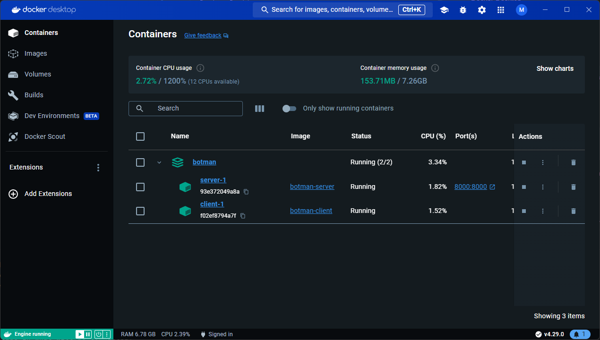

# BotMan
Quick setup for [BotManServer](https://github.com/Mahasvan/BotManServer) and [BotManClient](https://github.com/Mahasvan/BotManClient)

## Prerequisites
- Docker Desktop


## Installation
- Clone this repository:
  - ```shell
    git clone https://github.com/Mahasvan/BotMan --recurse-submodules
    ```
- Fill in the config values in `BotManClient` and `BotManServer` directories.
- For details, refer to the READMES of [BotManClient](https://github.com/Mahasvan/BotManClient) and [BotManServer](https://github.com/Mahasvan/BotManServer).
- Start Docker Desktop.
- Build the docker containers:
  - ```shell
    cd {project_root} 
    docker-compose -f docker-compose.yml up -d 
    ```
- This creates the server and client containers and runs them in the background.
- This is what your Docker Desktop should look like: 
- 


## Notes
- After cloning, fill in the required fields in the `config.json` files in the Client and Server directories without fail.
- To stop the containers, run:
  - ```shell
    docker-compose -f docker-compose.yml stop
    ```
- To stop and delete the containers, run:
  - ```shell
    docker-compose -f docker-compose.yml down
    ```
